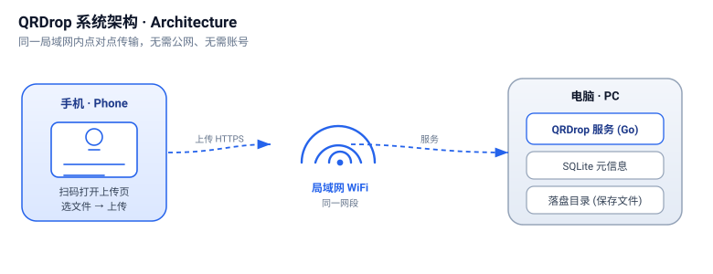
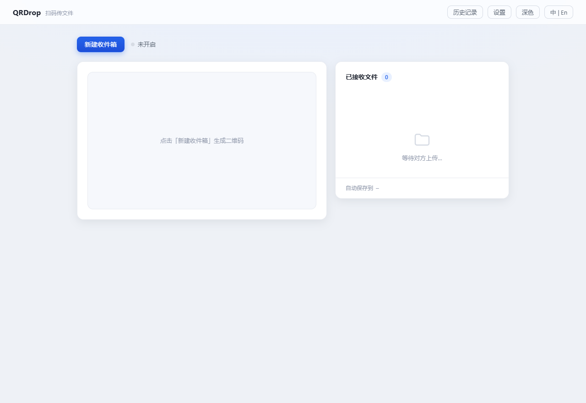
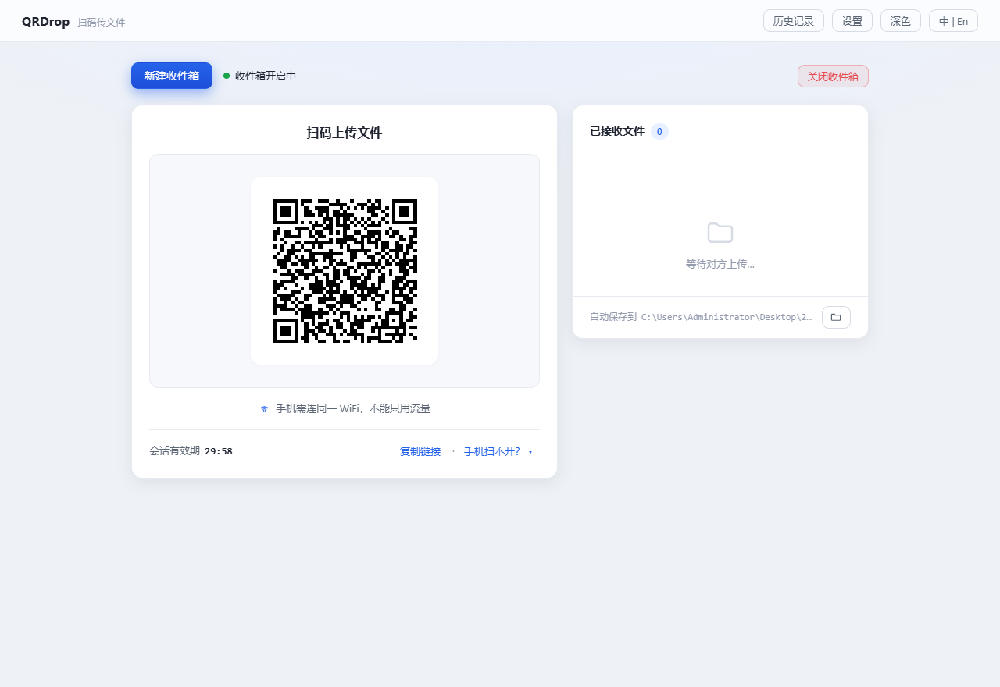
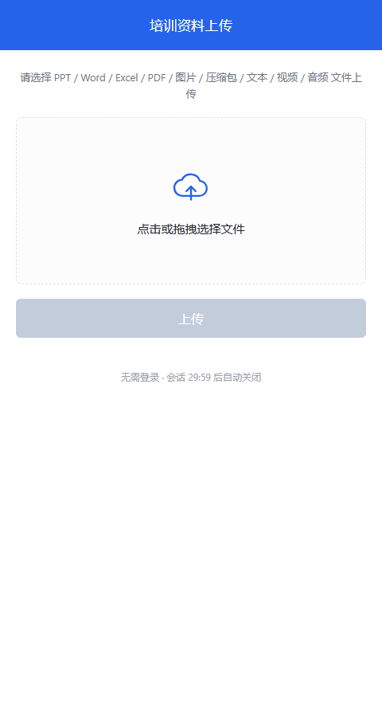
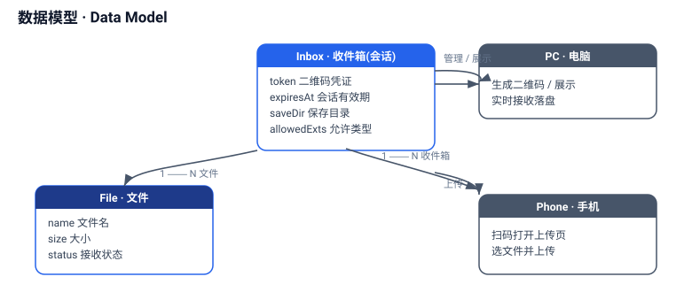
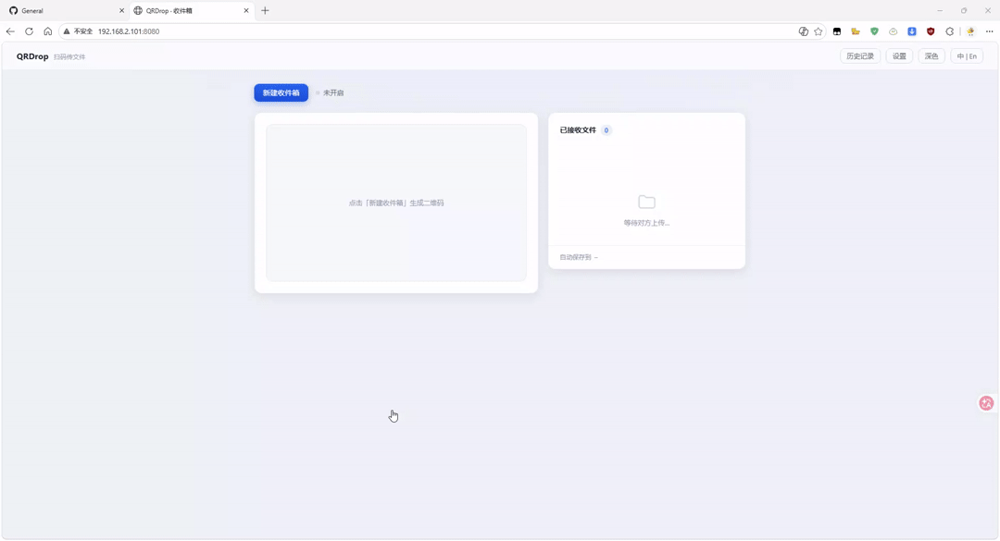

# QRDrop

> Private, LAN-friendly file transfer via QR code. Scan, upload, done — no accounts, no cloud.
>
> 基于二维码的私密局域网文件传输工具：扫码即传，无需账号，不经过云端。

QRDrop is a self-hosted, single-binary service written in **Go** with a tiny
vanilla-JS web UI and an embedded **SQLite** database (pure-Go driver,
no CGO). It lets you open a temporary "inbox" on your computer, display a QR
code, and have a phone (or any device on the same LAN) scan it to upload files
directly to your machine.

QRDrop 是一个自托管的单文件二进制服务，使用 **Go** 编写，前端为极简原生
JavaScript，数据库为内置 **SQLite**（纯 Go 驱动，无需 CGO）。它能在你的电脑上
开启一个临时「收件箱」并显示二维码，手机（或同局域网内的任何设备）扫码后即可
直接向本机上传文件。

[](https://github.com/lj874802276/qrdrop/releases)



## Download & Run (no build required)

Prebuilt binaries for **Windows / macOS / Linux** (Intel & Apple Silicon) are attached to every [GitHub Release](https://github.com/lj874802276/qrdrop/releases). Download, unzip, and run — no Go toolchain, no Docker.

- **Windows:** double-click `qrdrop.exe`. It prints the LAN address and opens your browser automatically.
- **macOS / Linux:** run `./qrdrop` from a terminal.

On first run a browser opens to the LAN address so phones can scan immediately. Set `QRDROP_NO_BROWSER=1` to disable the auto-open (useful on servers).

## 下载即用（无需构建）

每个 [GitHub Release](https://github.com/lj874802276/qrdrop/releases) 都附带 **Windows / macOS / Linux**（Intel 与 Apple Silicon）的预编译二进制。下载解压即可运行 —— 无需 Go 工具链，也无需 Docker。

- **Windows：** 双击 `qrdrop.exe`，会自动打印局域网地址并打开浏览器。
- **macOS / Linux：** 在终端执行 `./qrdrop`。

首次运行会自动打开浏览器并定位到局域网地址，手机即可立即扫码。服务器/无头环境可设 `QRDROP_NO_BROWSER=1` 关闭自动打开。

---

# English

## Screenshots

| Home | Inbox (QR) | Upload page (phone) |
|---|---|---|
|  |  |  |

## Features

- **Zero-config, single binary** — no database server, no external services, no accounts.
- **QR-code pairing** — open an inbox, show the QR, scan with a phone to upload.
- **Real-time list** — uploaded files appear instantly via WebSocket.
- **Configurable save location** — Default directory / Desktop / Custom folder,
  chosen in Settings and persisted.
- **History & traceability** — past inboxes are kept; closing an inbox never deletes
  already-received files.
- **Private by design** — files stay on your machine; nothing leaves the LAN.

## Requirements

- **Go 1.22+** is required only to build. The produced binary is static and needs
  no Go toolchain at runtime.
- No CGO, no system dependencies. SQLite is embedded.

## Build from source

```bash
git clone <your-repo-url> qrdrop
cd qrdrop
go build -o qrdrop .

# for a fully static binary (recommended for deployment / Docker):
CGO_ENABLED=0 go build -o qrdrop .
```

> Note: the module path is `github.com/lj874802276/qrdrop` (this repository).
> Release binaries are built automatically from `v*` tags via GoReleaser — see
> `.goreleaser.yaml` and `.github/workflows/release.yml`.

## Run

```bash
./qrdrop
# then open http://localhost:8080
```

With common overrides:

```bash
QRDROP_ADDR=:9090 QRDROP_DATA_DIR=./data ./qrdrop
```

The service binds all interfaces (`0.0.0.0`) by default, so other devices on the
LAN can reach it.

## Configuration

All options are passed through environment variables.

| Variable               | Default      | Description                                                                 |
|------------------------|--------------|-----------------------------------------------------------------------------|
| `QRDROP_ADDR`          | `:8080`      | Listen address (host:port).                                                 |
| `QRDROP_DATA_DIR`      | `data`       | Directory for the SQLite database and received files.                       |
| `QRDROP_BASE_URL`      | _(empty)_    | Public base URL for QR codes when behind a reverse proxy / different host.  |
| `QRDROP_SESSION_TTL`   | `30m`        | Lifetime of an inbox before it is considered expired.                       |
| `QRDROP_MAX_UPLOAD_MB` | `1024`       | Maximum size per upload, in megabytes.                                       |
| `QRDROP_ALLOWED_EXTS`  | _(safelist)_ | Comma-separated allowed file extensions (extension safelist).              |
| `QRDROP_SAVE_DIR`      | _(empty)_    | Hard override for the file save location; takes precedence over Settings.    |
| `QRDROP_NO_BROWSER`    | _(empty)_    | Set to any value to disable auto-opening the browser on startup.             |

Settings chosen in the UI (save location) are persisted to
`<QRDROP_DATA_DIR>/settings.json` and can be overridden per-run by
`QRDROP_SAVE_DIR`.

## Docker

```bash
docker build -t qrdrop .
docker run -d --name qrdrop \
  -p 8080:8080 \
  -v qrdrop-data:/app/data \
  qrdrop
```

The image is multi-stage and produces a static binary; the default listen port is
`8080` and the data directory is `/app/data` (mount a volume to persist files).

## How it works



1. Open the host page in a browser — a session (inbox) is created and a QR code is shown.
2. Scan the QR with a phone — it opens the upload page (the URL carries the session token).
3. Pick files and upload — they are stored under `<save_dir>/<token>/`; the host list updates live via WebSocket.
4. Use **Open folder** to reveal the files in your file manager, or **History** to review past inboxes.

## Demo



## Important notes

- **LAN access (automatic):** on startup QRDrop detects your LAN IP, opens the browser
  there, and the QR code uses that address even if you later open the page on `localhost`.
  Phones therefore scan a reachable address by default — no manual switch to your LAN IP
  is required. (Set `QRDROP_NO_BROWSER=1` on headless servers.)
- **Firewall:** allow inbound TCP on the listen port, or the phone's requests will be dropped.
- **Save location is snapshot per inbox:** changing the global setting only affects
  *new* inboxes. Existing inboxes keep their original path so history stays traceable.
- **Closing an inbox does NOT delete received files** — only an explicit manual
  deletion removes them.

## License

Released under the [MIT License](./LICENSE).

---

# 简体中文

## 界面预览

| 主页 | 收件箱（二维码） | 手机上传页 |
|---|---|---|
|  |  |  |

## 功能特性

- **零配置、单文件二进制** —— 无需数据库服务、无需外部依赖、无需账号。
- **二维码配对** —— 开启收件箱、展示二维码，手机扫码即可上传。
- **实时列表** —— 通过 WebSocket，上传的文件即时出现在主机页面。
- **可配置保存位置** —— 默认目录 / 桌面 / 自定义文件夹，在设置中选择并持久化。
- **历史可追溯** —— 保留历史收件箱；关闭收件箱**不会**删除已接收的文件。
- **隐私优先** —— 文件始终留在你的机器上，不出局域网。

## 环境要求

- 构建只需 **Go 1.22+**。生成的二进制为静态文件，运行时不再需要 Go 工具链。
- 无需 CGO，无系统级依赖。SQLite 已内置。

## 从源码构建

```bash
git clone <你的仓库地址> qrdrop
cd qrdrop
go build -o qrdrop .

# 生成完全静态的二进制（推荐用于部署 / Docker）：
CGO_ENABLED=0 go build -o qrdrop .
```

> 说明：模块路径即 `github.com/lj874802276/qrdrop`（即本仓库）。
> 发布二进制由 `v*` 标签经 GoReleaser 自动构建，配置见
> `.goreleaser.yaml` 与 `.github/workflows/release.yml`。

## 运行

```bash
./qrdrop
# 然后浏览器打开 http://localhost:8080
```

带常用参数运行：

```bash
QRDROP_ADDR=:9090 QRDROP_DATA_DIR=./data ./qrdrop
```

服务默认监听所有网卡（`0.0.0.0`），因此局域网内的其他设备也可访问。

## 配置项

所有选项均通过环境变量传入。

| 变量                   | 默认值        | 说明                                                                       |
|------------------------|--------------|----------------------------------------------------------------------------|
| `QRDROP_ADDR`          | `:8080`      | 监听地址（host:port）。                                                      |
| `QRDROP_DATA_DIR`      | `data`       | SQLite 数据库与已接收文件的存放目录。                                        |
| `QRDROP_BASE_URL`      | _（空）_     | 位于反向代理 / 不同主机后，二维码使用的对外基础 URL。                         |
| `QRDROP_SESSION_TTL`   | `30m`        | 收件箱的有效时长，超时后视为过期。                                            |
| `QRDROP_MAX_UPLOAD_MB` | `1024`       | 单次上传的最大体积（单位：MB）。                                              |
| `QRDROP_ALLOWED_EXTS`  | _（安全白名单）_ | 逗号分隔的允许上传的扩展名。                                               |
| `QRDROP_SAVE_DIR`      | _（空）_     | 文件保存位置的硬覆盖值，优先级高于界面设置。                                  |
| `QRDROP_NO_BROWSER`    | _（空）_     | 设为任意值可关闭启动时自动打开浏览器的行为。                                  |

在界面中选择的设置（保存位置）会持久化到 `<QRDROP_DATA_DIR>/settings.json`，
并可在每次运行时被 `QRDROP_SAVE_DIR` 覆盖。

## Docker 部署

```bash
docker build -t qrdrop .
docker run -d --name qrdrop \
  -p 8080:8080 \
  -v qrdrop-data:/app/data \
  qrdrop
```

镜像为多阶段构建，产出静态二进制；默认监听端口为 `8080`，数据目录为
`/app/data`（挂载卷即可持久化文件）。

## 工作原理


1. 浏览器打开主机页面 —— 系统创建一个会话（收件箱）并展示二维码。
2. 手机扫码 —— 打开上传页（URL 中携带会话令牌 token）。
3. 选择文件并上传 —— 文件存入 `<save_dir>/<token>/` 目录，主机列表经 WebSocket 实时刷新。
4. 点击 **打开文件夹** 在文件管理器中定位文件，或点击 **历史** 查看过往收件箱。

## 动态演示


## 注意事项

- **局域网访问（已自动）：** 启动时 QRDrop 会自动探测你的局域网 IP，并把浏览器打开到该地址；
  即便你之后用 `localhost` 打开页面，二维码也会使用局域网地址。因此手机默认就能扫到可达地址，
  无需手动切换到局域网 IP。（无头服务器可设 `QRDROP_NO_BROWSER=1` 关闭自动打开。）
- **防火墙：** 放行监听端口的入站 TCP，否则手机请求会被丢弃。
- **保存位置按收件箱快照：** 修改全局设置只影响**新**收件箱；旧收件箱保留原路径，历史始终可追溯。
- **关闭收件箱不会删除已接收文件** —— 只有显式手动删除才会移除它们。

## 许可证

基于 [MIT 许可证](./LICENSE) 发布。
